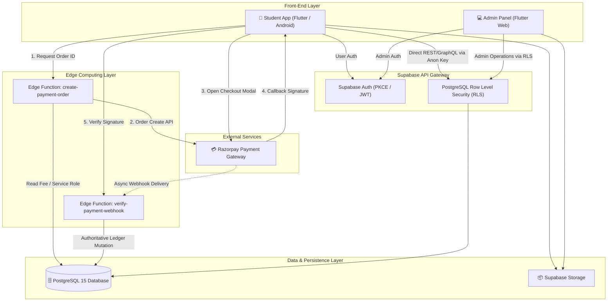

# 🎓 Ajay Infotech Management System

[](https://flutter.dev)
[](https://dart.dev)
[](https://supabase.com)
[](https://razorpay.com)
[](LICENSE)

A unified, full-stack educational institute management ecosystem and student learning platform. The system comprises a **Student Mobile App** (Flutter / Android), an **Admin Web Portal** (Flutter Web), and a **Cloud Backend** (Supabase PostgreSQL 15, Deno Edge Functions, and Razorpay payment gateway).

---

## 📑 Table of Contents

1. [Project Overview](#-project-overview)
2. [System Architecture](#-system-architecture)
3. [Student Mobile App](#-student-mobile-app)
4. [Admin Web Panel](#-admin-web-panel)
5. [Supabase Backend & Database](#-supabase-backend--database)
6. [Authentication Flow](#-authentication-flow)
7. [Storage Architecture](#-storage-architecture)
8. [Razorpay Payment Pipeline](#-razorpay-payment-pipeline)
9. [Edge Functions](#-edge-functions)
10. [Database Schema Overview](#-database-schema-overview)
11. [Local Development & Setup](#-local-development--setup)
12. [Environment Configuration](#-environment-configuration)
13. [Testing & Quality Assurance](#-testing--quality-assurance)
14. [Android Build & Release](#-android-build--release)
15. [Admin Web Deployment](#-admin-web-deployment)
16. [Security & Secret Management](#-security--secret-management)
17. [Documentation Directory](#-documentation-directory)

---

## 🌟 Project Overview

Ajay Infotech Management System centralizes training center operations into a single synchronized platform:
* **For Students**: Real-time attendance statistics, course materials, fee ledger tracking, electronic installment payment via Razorpay, receipt downloads, and leave requests.
* **For Administrators**: Institutional dashboards, batch & course orchestration, attendance marking, student lifecycle management, fee tracking with automated receipt generation, and role-based staff permissions.

---

## 🏗 System Architecture



---

## 📱 Student Mobile App

Located in [`student-app/`](student-app/):
* **State Management**: Flutter Riverpod for reactive state management.
* **Features**:
  * Personalized student dashboard with upcoming sessions and batch details.
  * Attendance dashboard with percentage visualizer.
  * Fee ledger displaying total fee, paid amount, pending balance, and installment breakdowns.
  * Seamless Razorpay payment gateway integration with instant receipt generation.
  * Assignment submission tracking.
  * Leave application status and history.

---

## 💻 Admin Web Panel

Located in [`admin-panel/`](admin-panel/):
* **State Management**: Flutter Riverpod.
* **Features**:
  * Institute performance metrics (Active students, revenue, outstanding fees, attendance rates).
  * Student enrollment and academic profile management.
  * Batch and course schedule management.
  * Attendance register with bulk daily marking.
  * Fee collection ledger with manual cash recording and digital payment reconciliation.
  * Leave request approval workflows.
  * Role-Based Access Control (`super_admin`, `admin`, `faculty`).
  * Immutable administrative audit trail.

---

## 🗄️ Supabase Backend & Database

The backend is built on Supabase PostgreSQL 15:
* **Automated Migrations**: Version-controlled SQL scripts in [`supabase/migrations/`](supabase/migrations/).
* **Base Schema**: Comprehensive table layout, constraints, and indexes in [`supabase/schema.sql`](supabase/schema.sql).
* **Storage & Security Policies**: Granular storage policies and security definitions in [`supabase/phase2_storage_and_security.sql`](supabase/phase2_storage_and_security.sql).

---

## 🔐 Authentication Flow

1. **PKCE Flow**: Implements Proof Key for Code Exchange (PKCE) for secure token exchanges without exposing credentials.
2. **Session Persistence**: Automatic refresh token rotation managed by `supabase_flutter`.
3. **Role Validation**: Custom claims and database lookup in `admin_users` for administrative authentication.

---

## 📦 Storage Architecture

Supabase Storage buckets are organized with strict access controls:
* `student-avatars`: Student profile images (Public read, authenticated user write).
* `course-materials`: Course syllabi and study materials (Public read for enrolled students).
* `assignment-submissions`: Student homework submissions (Restricted to student owner and admin staff).
* `payment-receipts`: Generated fee receipts (Restricted to student owner and admin staff).

---

## 💳 Razorpay Payment Pipeline

1. **Order Creation**: Client requests an order from `create-payment-order` Edge Function. The function verifies student identity and calculates the canonical installment balance from the database.
2. **Checkout**: Razorpay Flutter SDK launches the checkout modal using only the public `RAZORPAY_KEY_ID`.
3. **Signature Verification**: On transaction completion, `verify-payment-webhook` computes the HMAC SHA-256 signature using `RAZORPAY_KEY_SECRET`.
4. **Idempotent Ledger Settlement**: After signature verification, the database atomically updates `payments`, marks the `fee_installments` record as `paid`, deducts `fees.outstanding_amount`, and issues a unique receipt number (`AI-REC-YYYY-XXXXX`).

---

## ⚡ Edge Functions

Located in [`supabase/functions/`](supabase/functions/):
* **`create-payment-order`**: Deno TypeScript serverless function to securely initiate Razorpay orders.
* **`verify-payment-webhook`**: Authoritative signature verification and idempotent database updater.

---

## 📊 Database Schema Overview

```
profiles                (id, full_name, email, phone, roll_number, created_at)
courses                 (id, title, description, fee_amount, duration_months)
batches                 (id, course_id, batch_name, start_date, end_date)
enrollments             (id, student_id, batch_id, enrollment_date, status)
attendance              (id, student_id, batch_id, date, status, remarks)
fees                    (id, student_id, total_amount, paid_amount, outstanding_amount, status)
fee_installments        (id, fee_id, installment_number, amount, due_date, paid_date, status, receipt_no)
payments                (id, student_id, installment_id, amount, razorpay_order_id, razorpay_payment_id, status)
leave_requests          (id, student_id, start_date, end_date, reason, status, reviewed_by)
admin_users             (id, full_name, email, role, is_active)
audit_logs              (id, admin_id, action, entity_type, entity_id, old_values, new_values, created_at)
```

---

## 🚀 Local Development & Setup

### Prerequisites
* Flutter SDK (3.24.x+)
* Dart SDK (3.5.x+)
* Android Studio / VS Code
* Chrome Browser

### 1. Student Mobile App
```bash
cd student-app
cp .env.example .env
flutter pub get
flutter run
```

### 2. Admin Web Panel
```bash
cd admin-panel
cp .env.example .env
flutter pub get
flutter run -d chrome
```

---

## ⚙️ Environment Configuration

| Variable | Target | Description | Example |
| :--- | :--- | :--- | :--- |
| `SUPABASE_URL` | Student & Admin | Supabase Project URL | `https://your-project.supabase.co` |
| `SUPABASE_ANON_KEY` | Student & Admin | Supabase Public Anon Key | `eyJhbGciOi...` |
| `RAZORPAY_KEY_ID` | Student App | Razorpay Public Key ID | `rzp_test_...` |
| `RAZORPAY_KEY_SECRET` | Edge Function Secret | Private Razorpay API Secret | *Set via Supabase CLI only* |
| `RAZORPAY_WEBHOOK_SECRET` | Edge Function Secret | Razorpay Webhook Secret | *Set via Supabase CLI only* |

---

## 🧪 Testing & Quality Assurance

```bash
# Student App Static Analysis & Unit Tests
cd student-app
flutter analyze
flutter test

# Admin Panel Static Analysis & Unit Tests
cd admin-panel
flutter analyze
flutter test
```

---

## 📱 Android Build & Release

To compile release APKs or Google Play App Bundles:
```bash
cd student-app
# Build split APKs
flutter build apk --release --split-per-abi

# Build App Bundle
flutter build appbundle --release
```

---

## 🌐 Admin Web Deployment

Compile production-optimized web bundles:
```bash
cd admin-panel
flutter build web --release --web-renderer canvaskit
```
Deploy the output `admin-panel/build/web` directory to Vercel, Netlify, Cloudflare Pages, or Firebase Hosting.

---

## 🛡️ Security & Secret Management

* **Zero Client Secrets**: Live service role keys and Razorpay secrets are **NEVER** stored in source code, client builds, or Git repositories.
* **RLS Enforcement**: Every database query through the client SDK is constrained by PostgreSQL Row Level Security.
* **Idempotent Transactions**: Unique payment constraints eliminate double deductions.

---

## 📚 Documentation Directory

Detailed architectural guides and deployment runbooks are available in the [`docs/`](docs/) directory:
* [Architecture Overview](docs/architecture/OVERVIEW.md)
* [Payment Pipeline Deep Dive](docs/architecture/PAYMENT_PIPELINE.md)
* [Database Schema Reference](docs/architecture/DATABASE_SCHEMA.md)
* [Security Model](docs/architecture/SECURITY.md)
* [Local Setup Guide](docs/setup/LOCAL_SETUP.md)
* [Supabase Configuration Guide](docs/setup/SUPABASE_SETUP.md)
* [Razorpay Integration Guide](docs/setup/RAZORPAY_SETUP.md)
* [Android Build Guide](docs/deployment/ANDROID_BUILD.md)
* [Web Deployment Guide](docs/deployment/WEB_DEPLOYMENT.md)
* [Edge Functions Guide](docs/deployment/EDGE_FUNCTIONS.md)

---

## 📄 License

This project is licensed under the [MIT License](LICENSE).
