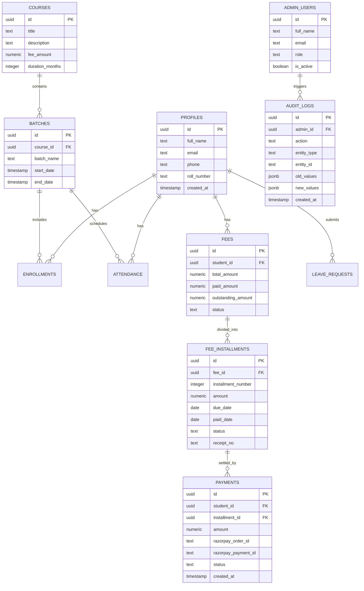

# Database Schema & Data Models

The Ajay Infotech system utilizes PostgreSQL 15 managed by Supabase. All tables implement strict Row Level Security (RLS) policies to ensure data isolation.

---

## Core Entities & Relationships

---

## Key Tables

### 1. `profiles`
Stores extended user profile information linked directly to `auth.users(id)`.

### 2. `fees` & `fee_installments`
* `fees`: Aggregated financial account for a student's enrolled courses.
* `fee_installments`: Granular installment breakdown with due dates, payment status (`pending`, `paid`, `overdue`), and unique receipt identifiers.

### 3. `payments`
Ledger recording all electronic transactions, containing Razorpay order and payment IDs with cryptographic verification metadata.

### 4. `admin_users` & `audit_logs`
* `admin_users`: Role-Based Access Control (`super_admin`, `admin`, `faculty`).
* `audit_logs`: Immutable tracking log for administrative operations.
