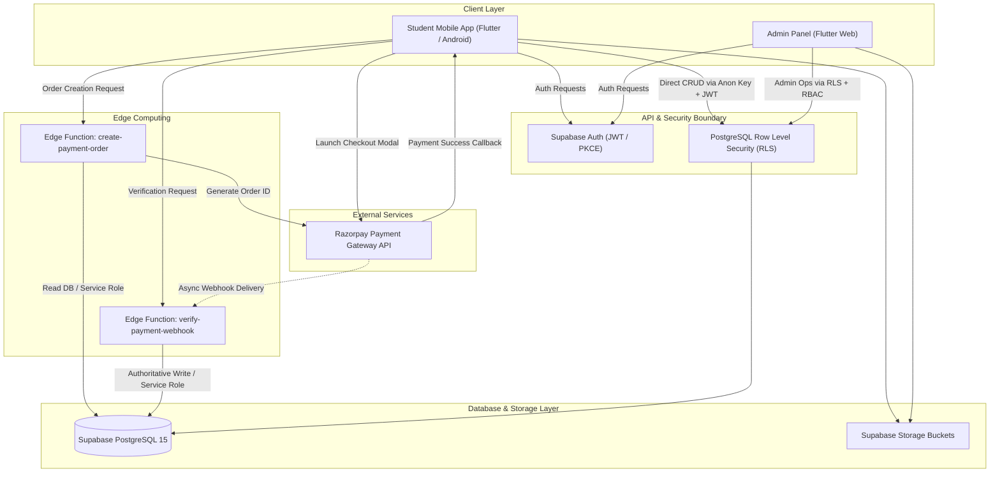

# System Architecture Overview

The **Ajay Infotech Management System** is a unified institute management and student learning platform consisting of a Flutter mobile application for students, a Flutter web application for administrative staff, and a PostgreSQL database powered by Supabase with serverless Deno Edge Functions and Razorpay payment integration.

---

## High-Level Architecture Diagram

---

## System Components

### 1. Student Mobile Application (`student-app/`)
* **Framework**: Flutter 3 (Android target)
* **State Management**: Flutter Riverpod
* **Features**:
  * Profile management & enrolled courses
  * Attendance tracking with statistical breakdown
  * Fee ledger, installment breakdown, and invoice receipt viewer
  * Razorpay payment gateway integration for direct installment settlement
  * Assignment downloads and submission tracking
  * Institute announcements and push notifications

### 2. Admin Web Panel (`admin-panel/`)
* **Framework**: Flutter Web (Responsive desktop dashboard)
* **State Management**: Flutter Riverpod
* **Features**:
  * Executive dashboard with real-time statistics (students, batches, revenue)
  * Student enrollment and batch management
  * Course curriculum and module configuration
  * Daily attendance marking and report generation
  * Fee collection overview and manual/automatic payment verification
  * Leave request approval/rejection workflows
  * Super Admin and Staff role-based access control (RBAC)
  * Comprehensive audit logging of administrative actions

### 3. Supabase Backend (`supabase/`)
* **Database**: PostgreSQL 15
* **Authentication**: Email/password with PKCE flow and custom user metadata
* **Security Model**: Row Level Security (RLS) policies isolating student records
* **Edge Functions (Deno / TypeScript)**:
  * `create-payment-order`: Verifies student identity and creates cryptographic order with Razorpay
  * `verify-payment-webhook`: Authoritatively verifies Razorpay HMAC SHA-256 signatures and reconciles database ledgers

---

## Data Flow Principles

1. **Least Privilege**: The mobile client has access only through Row Level Security using the user's JWT. Direct updates to financial balances are strictly prohibited.
2. **Server-Side Financial Authority**: Only trusted backend Edge Functions executing with `SUPABASE_SERVICE_ROLE_KEY` can mutate payment statuses, ledger balances, and issue receipt numbers.
3. **Idempotency**: All payment transactions require unique order and payment IDs to avoid duplicate billing.
