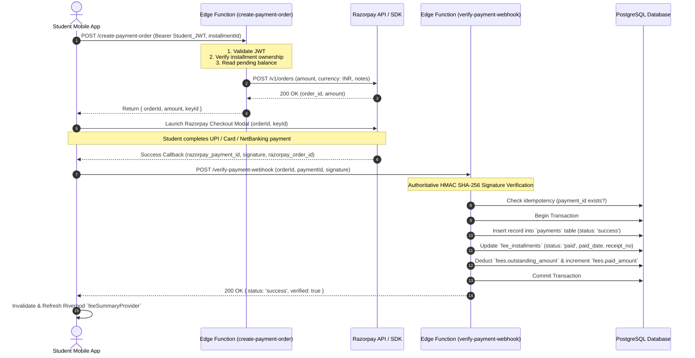

# Payment Pipeline & Security Architecture

This document details the end-to-end payment integration between the Student Mobile App, Supabase Edge Functions, Razorpay Gateway, and the PostgreSQL database ledger.

---

## Payment Sequence Flow

---

## Critical Security Controls

### 1. Zero Secrets in Client Applications
* Mobile and web applications **never** possess `RAZORPAY_KEY_SECRET`, `RAZORPAY_WEBHOOK_SECRET`, or `SUPABASE_SERVICE_ROLE_KEY`.
* Only the client-safe public identifier (`RAZORPAY_KEY_ID`) and public anon key (`SUPABASE_ANON_KEY`) are present on client devices.

### 2. Cryptographic Signature Verification
* Verification is executed in `verify-payment-webhook` using Node/Deno Web Crypto `HMAC-SHA256`:
  $$\text{expected\_signature} = \text{HMAC-SHA256}(\text{order\_id} + "|" + \text{payment\_id}, \text{RAZORPAY\_KEY\_SECRET})$$
* Any mismatch immediately halts the transaction and logs a security violation.

### 3. Idempotency & Replay Prevention
* The PostgreSQL `payments` table maintains a `UNIQUE (razorpay_payment_id)` constraint.
* If a duplicate verification request or webhook retry arrives, the Edge Function safely detects existing status and returns success without deducting duplicate balances.

### 4. Deterministic Receipt Generation
* When an installment is settled, the server issues a standardized receipt sequence:
  `AI-REC-{YEAR}-{RANDOM_OR_SEQUENCE}`
